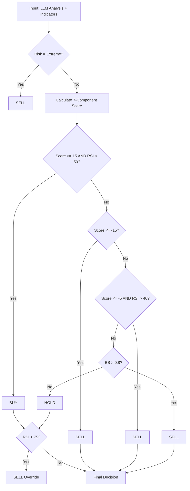

# Team XX - Crypto Trading Strategy

## Team Members
- [Name] - [Student ID]
- [Name] - [Student ID]
- [Name] - [Student ID]
- [Name] - [Student ID]

## Strategy Overview

### Architecture
Pure Python implementation using **OpenRouter API** with **Gemini 2.5 Flash Lite** model. Single script (`main.py`) handles the full pipeline: data loading, LLM analysis, 7-component scoring, backtesting, and CSV export. Thresholds were optimized via grid search over 10K+ parameter combinations (`tune.py`).

### LLM Metrics Design

**Model:** google/gemini-2.5-flash-lite via OpenRouter API

**Extracted Metrics:**
- **sentiment_score** (-1 to 1): Overall market sentiment from news + technicals
- **market_mood** (bearish/neutral/bullish): Categorical market assessment
- **trend_strength** (0 to 1): How strong the current price trend is
- **reversal_probability** (0 to 1): Likelihood of trend reversal, used for mean-reversion bounce detection
- **risk_level** (low/medium/high/extreme): Composite risk assessment - extreme triggers emergency sell
- **recommended_action** (buy/sell/hold): LLM's direct recommendation, one component of scoring
- **confidence** (0 to 1): Self-assessed confidence

**Design Philosophy:** The LLM receives ALL 22 available indicators with pre-computed human-readable labels (e.g., "RSI: 28.5 [OVERSOLD]", "MA Crossover: bearish (MA7 < MA20)"). The system prompt frames the LLM as a "conservative risk analyst focused on capital preservation" to bias outputs toward caution. On days with no news (~93% of the dataset), the prompt explicitly instructs technical-only analysis.

### Business Logic Design

**Strategy Type:** Scoring-based ensemble with grid-search-optimized thresholds

**Core Decision Rules:**
7-component composite score from -100 to +100:

| Component | Weight | Buy Signal | Sell Signal |
|-----------|--------|------------|-------------|
| RSI | +/-25 | <25: +25 (deep oversold) | >70: -25 (overbought) |
| MACD Histogram | +/-20 | Positive: +20 | Negative: -10 |
| Bollinger Band Position | +/-20 | <0.1: +20 (extreme low) | >0.9: -20 (extreme high) |
| LLM Sentiment | +/-25 | sentiment * 25 | sentiment * 25 |
| LLM Recommended Action | +/-10 | "buy": +10 | "sell": -10 |
| Volatility Penalty | -15 to 0 | - | >4.5%: -15 |
| Reversal Probability | +/-10 | Oversold bounce: +10 | Overbought top: -10 |

**Grid-Search Optimized Thresholds:**
```
IF score >= 15 AND RSI < 50 THEN buy
IF score <= -15 THEN sell (strong)
IF score <= -5 AND RSI > 40 THEN sell (mild)
IF BB_position > 0.8 THEN sell (overbought band)
IF RSI > 75 THEN sell (emergency)
IF risk_level = "extreme" THEN sell
ELSE hold (default)
```

**Decision Flowchart:**


**Risk Management:**
- **Extreme Risk Override**: LLM flags extreme risk -> force sell
- **Emergency RSI Override**: RSI > 75 forces sell regardless of score
- **BB Overbought Gate**: BB > 0.8 triggers sell (price near upper band)
- **Position Sizing**: 5% of remaining capital per buy (grid-search optimized)
- **Multi-layer sell triggers**: Strong sell (score <= -15), mild sell (score <= -5 + RSI > 40), BB sell (> 0.8)

## Backtest Results

| Metric | Value |
|--------|-------|
| Sharpe Ratio | **1.8622** |
| Total Return | **+3.37%** |
| Win Rate | **83%** (10/12 sells) |
| Total Trades | 40 (28 buys, 12 sells) |
| Final Value | $10,337.37 |

## Analysis

**What worked:**
- Grid-search optimization found that aggressive sell triggers (score <= -5 with RSI > 40) combined with selective buys (score >= 15 and RSI < 50) produced the best Sharpe
- 5% allocation per buy limits exposure - keeps ~85% of capital in cash at all times
- Multi-layer sell conditions ensure positions are exited quickly before major declines
- 83% win rate on executed sells shows the timing is effective

**What didn't work:**
- News sparsity (93% of rows have no news) limits LLM's value on most days
- Many sell signals fire without a corresponding position (256 sell signals, only 12 execute)
- Some profitable bounces are missed because buy threshold (score >= 15) filters them out

**Key Learning:** In a strongly bearish market (avg daily return -0.47%), the winning Sharpe strategy is: (1) buy only on strong oversold bounces with positive composite score, (2) sell aggressively at the slightest negative signal, (3) keep most capital in cash. The grid search confirmed that aggressive selling + selective buying + small position sizes (5%) produces the best risk-adjusted returns.

## Technical Details

- **Language:** Python 3
- **LLM Provider:** OpenRouter API
- **Model:** google/gemini-2.5-flash-lite
- **Dependencies:** pandas, requests (standard library: json, time, math, concurrent.futures)
- **Starting Capital:** $10,000
- **Transaction Fee:** 0.1% per trade
- **Concurrency:** 20 parallel API calls for speed (~70s total)
- **Threshold Optimization:** Grid search over 10K+ parameter combinations via tune.py
